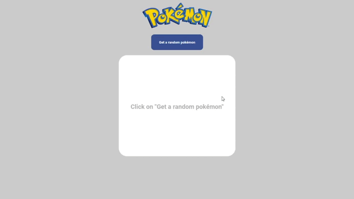

<h1 align="center">
   Desafio Kaiz Telecom
</h1>

 

## 📷: Demonstração

  

## 🚀 Tecnologias:

Esse projeto foi desenvolvido com as seguintes tecnologias:

✔️React
✔️Typescript
✔️Styled-components

## 🚀 Como Inicar o projeto:

PASSO1: Instale o NODEJS em sua máquina, se já tiver instalado não é necessário instalar novamente.

PASSO2: Abre a pasta e acesse o terminal do seu sistema operacional, digite NPM START, caso tenha o Yarn instalado é só digitar YARN START.

## Observações:

(Infelizmente não conseguir mudar a cor do fundo 😢, porém a cor do tipo de pokemon é mostrado no projeto.)
